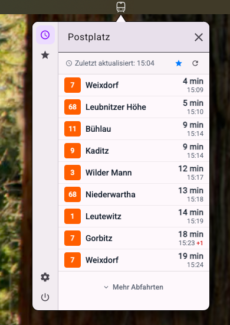
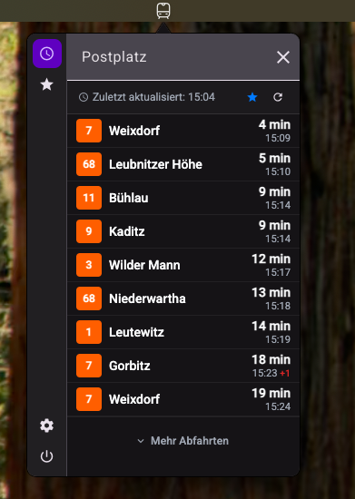

# DDPlan

**DDPlan** - A modern menubar application built with [Electron](http://electron.atom.io/), [Angular](https://angular.io/) and [dvbjs](https://github.com/offenesdresden/dvbjs) that provides real-time timetables for trams, buses and trains in Dresden, Germany.

## Screenshots

| Light Theme                                            | Dark Theme                                           |
| ------------------------------------------------------ | ---------------------------------------------------- |
|  |  |

## Features

- 🚌 Real-time departure information for Dresden public transport
- ⭐ Favorite stops management
- 🌙 Light and dark theme support
- 🔍 Smart stop search with autocomplete
- 📱 Clean, modern interface

## Download

Ready to use DDPlan? Download the latest version for your platform:

**[📥 Download Latest Release](https://github.com/4gray/ddplan/releases/latest)**

Available for:

- 🍎 **macOS** - `.dmg` installer
- 🐧 **Linux** - `.AppImage`, `.deb`, `.rpm` packages
- 🪟 **Windows** - `.exe` installer

> **Note**: The app is not code-signed, so you may need to allow it in your system's security settings when running for the first time.

## Prerequisites

- Node.js (version 18 or higher recommended)
- npm or yarn package manager

## Installation

1. **Clone the repository**

    ```bash
    git clone https://github.com/4gray/ddplan.git
    cd ddplan
    ```

2. **Install dependencies**
    ```bash
    npm install
    ```

## Development

### Start development server (Web)

```bash
npm start
# or
npm run start:ng
```

This starts the Angular development server at `http://localhost:4200`

### Start development with Electron

```bash
npm run start:dev
```

This runs both Angular dev server and Electron in development mode with hot reload.

### Start Electron app (Production-like)

```bash
npm run start:electron
```

This builds the Angular app and starts Electron.

## Building

### Build Angular app

```bash
npm run build
# or for Electron
npm run build:ng
```

### Package Electron app

```bash
npm run package:electron
```

This creates distributable packages for your current platform.

### Cross-platform packaging

For specific platforms:

```bash
# macOS
npm run package:electron -- --mac

# Linux
npm run package:electron -- --linux

# Windows
npm run package:electron -- --win
```

### Watch mode (for development)

```bash
npm run watch
```

## Continuous Integration

This project uses GitHub Actions for automated building and packaging:

- **Pull Requests**: Automatically builds and tests the app for all platforms
- **Tagged Releases**: Creates release artifacts for macOS, Linux, and Windows
- **Manual Builds**: Can be triggered via workflow dispatch

The CI/CD pipeline:

1. Builds the Angular app
2. Runs linting checks
3. Packages Electron apps for all platforms
4. Uploads build artifacts
5. Creates GitHub releases for tagged versions

## Project Structure

```
src/
├── app/
│   ├── components/          # Angular components
│   │   ├── favorites/       # Favorites management
│   │   ├── header/          # App header
│   │   ├── plan-list/       # Departure times display
│   │   ├── search-field/    # Stop search functionality
│   │   ├── settings/        # App settings
│   │   ├── sidebar/         # Navigation sidebar
│   │   └── welcome-screen/  # Initial welcome screen
│   ├── interfaces/          # TypeScript interfaces
│   ├── services/            # Angular services
│   ├── app.config.ts        # App configuration
│   ├── app.ts              # Main app component
│   └── store.ts            # Signal-based state management
├── assets/                  # Static assets
└── styles.scss             # Global styles
```

## Contributing

1. Fork the repository
2. Create a feature branch (`git checkout -b feature/amazing-feature`)
3. Commit your changes (`git commit -m 'Add some amazing feature'`)
4. Push to the branch (`git push origin feature/amazing-feature`)
5. Open a Pull Request

## License

This project is open source. Please check the LICENSE file for details.

---

**Note**: This application is not officially affiliated with Dresden's public transport operator (DVB). It's a community project that uses publicly available transport data.
